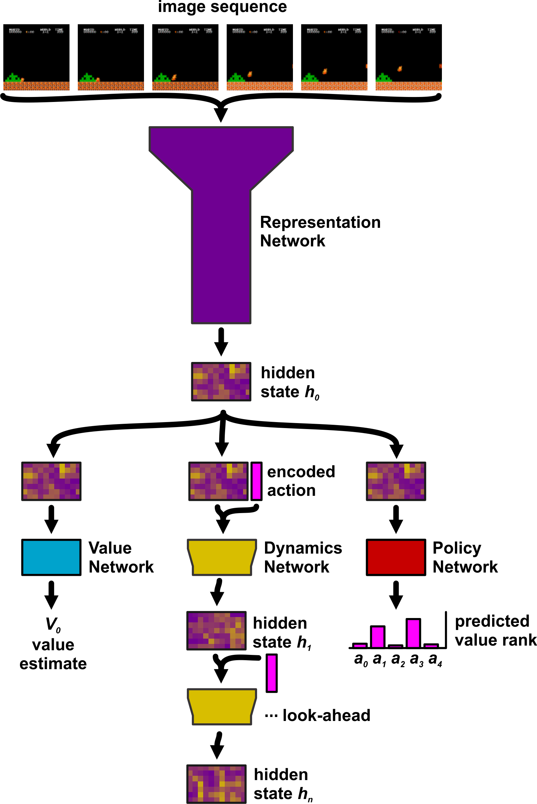

MuZero - Lite
======

This repository is a Python implementation of a heavily modified MuZero algorithm. The current configuration learns to play Super Mario Bros, but with modification it could be used to learn a number of OpenAI gym environments.

Examples
======

Below are examples of gameplay after 6 days of training on a gaming PC.

Neural Networks
======
 - Representation network: observation --> hidden state
 - Policy network: hidden state --> relative predicted value of each move
 - Value network: hidden state --> predicted value
 - Reward network: hidden state --> predicted reward
 - Dynamics network: hidden state + action --> hidden state (future)
 - Exploration network: hidden state --> predicted policy

Self Play
======
- Latest networks are loaded from file. The initial runs are performed with random moves using a Uniform network. 
- Instead of performing a Monte-Carlo tree search, actions are selected through a truncated search. The outputs of the Policy network are ranked and the highest-ranking moves are evaluated through a look-ahead search. During the look-ahead search, actions are chosen based on the maximum output of the Policy network. This ensures that the future value of an action is estimated in the context of the current policy.
- Policy exploration is not random. It is guided by an adversarial Exploration network.
- In self play during training, actions are selected with a probability based on their estimated value. This ensures that some off-policy actions are observed to help train the Value network.
- Games are saved to file instead of loaded directed into the replay_buffer.
- Gifs of each game are saved during training because they are fun to watch.

Network Training
======
- Games are loaded from file to fill the replay_buffer.
- Experiences are sampled using Prioritized Experience Replay.
- Policy network is trained to the results of the truncated search during self play. The policy trains directly to the relative predicted value of each move from the look-ahead search.
- Value network is trained to the time-discounted future value + discounted accumulated future reward.
- Reward network is trained to the reward values. Based on several recent papers and some experimentation, this network can probably be eliminated without affecting performance.
- Dynamics network is trained by unrolling future actions, policies, rewards, and values from the game history and training using the output of the Dynamics network as the hidden state.
- Exploration network is trained to the predicted policy from the Policy network. The loss value for the policy network is reduced by a fraction of the exploration network's loss. This guides the policy towards strategies it has not tried previously.
- Network updates are saved to file periodically.
- Initial training needs to be performed on random moves (self-play using the Uniform network). This sets the baseline output of the Value network near zero. If agents play using a network that has not been trained in this way, the estimated values will be inflated. Remember that the Value network trains to a bootstrap value: the estimated value inferred during self play. Without initial training, an incorrect bootstrap value can prevent the AI from learning.

**DISCLAIMER**: this code is early research code. What this means is:

- Silent bugs may exist.
- It may not work reliably on other environments or with other hyper-parameters.
- The code quality and documentation are quite lacking, and much of the code might still feel "in-progress".
- The training and testing pipeline is not very advanced.
- Not many comments, and many low-quality comments.

**Changes from SuperMarioBrosAI**:

- 2-player capability.
- Value Network output for each player overlayed on videos.
- Special moves encoded as discrete moves for 8 characters.
- Reward function changed.
- Change the step size of the Dynamic Model look-ahead function.
- Game state detection to facilitate "rest states" during gameplay. When a fighter is locked in animation and cannot act, the nueral network is not used for inference (reduces computation overhead over 90%).
- New Representation and Dynamic Network architectures based on Google's EfficientNet v1. 

**Brief Description**

Training Street Fighter 2 AIs proved to be much more challenging than the Super Mario Bros AI. Street Fighter 2 is a 2-player fighting game, so I implemented 2-player capabilities. The input for the neural network is an image sequence along with previous action encodings. These action encodings only represent the actions of the "self" player at the time of inference, giving each AI a slightly different "perspective" on the current game state. As with the Super Mario Bros AI, initial training on a random network was necessary to set a baseline for the Value Network.

In a 2-player setting, it is more difficult to judge if the network is learning. With the Super Mario Bros AI, it was easy to judge success as the AI learned to complete stages. In a 2-player game, the objective is to beat another AI which is also in the process of learning. Therefore I had to set up some criteria to ascertain if the AIs were improving. The approach I took was to analyze the strategy complexity for each AI. At different stages in the training, I looked at the frequency each move was chosen by the AI. A sufficiently complex strategy would include several different moves (no 1-button mashing!) and the preffered moves would change with different game states.

Below is a figure of how move frequencies changed throughout the training process for the Ryu vs Dhalsim AIs. The ridge plots on the left and right show move frequencing distributions as the training progressed. The center plot shows the winrates for each AI.

 

Examining the move frequency distributions, we can see that early in the training, the Ryu AI prefers to use his Hurricane Kick almost exclusively. As training progresses, the Hurricane Kick frequency decreases and movement actions and basic attacks increase in frequency. These changes coincide with Yoga Flame and Yoga Fire projectile moves increasing in frequency for the Dhalsim AI. As the training reaches late stages, the Ryu AI winrate falls until the Dhalsim AI becomes heavily favored.

These plots indicate that the AIs are learning a strategy and responding to the opponent's strategy, but are the AIs sufficiently complex? Are the observed changes simply a response to the move probabilities of the opponent, or are the AIs gaining a deeper understanding of the game? To help answer these questions, I analyzed how each AI responded to distance from opponent. Each move in Street Fighter 2 has a different range. A sufficiently complex AI should change its strategy based on how far away the opponent is. Below, I show ridge plots of move frequency distributions as the distance from the opponent decreases. The center plot shows the ouput of the Value Network as a function of distance to opponent. 

 

From these plots, we see that move preference changes with distance from opponent. The Ryu AI prefers movement actions when at a distance, but switches to Hurrican Kick when the character is within the effective range of that move. The Dhalsim AI prefers a projectile (Yoga Fire) when at a distance, and switches to Yoga Flame at medium distances. Taking a look at the center plot, we see that the Dhalsim AI views long distances more favorably, and, conversely, the Ryu AI views short distances more favorably. Taken together, I am satisfied that the AIs learned to play the game.

One interesting challenge came when training the Zangief AI. Zanfief has no projectiles and no special abilities that are movement abilities. As a grappler, Zangief must be in close range in order to damage the opponent. When faced against characters with projectiles, the Zangief AI would keep a distance and attempt to dodge incoming projectiles. The AI choose to minimize damage from projectiles and not approach the opponent to deal damage. To encourage the Zangief AI to close distance, I tried reward function shaping to encourage moving closer to the enemy, but that did not work. From a gameplay perspective, Zangief takes a lot of risk trying to close distance. The character must dodge projectiles and carefully time the approach to avoid a counter-attack. Due to the difficulty of a successful approach, I hypothesized that the AI was not experiencing very many game states at close distance, thus it had difficulty learning which moves were effective at close range. The solution was simple: every 10th game the AI training against a dummy AI which did not act. This allowed the Zangief AI to safely approach the enemy and try out different damaging moves. This proved to overcome the hurdle, and the Zangief AI learned to seek out and take advantage of every close-range opportunity. This is a great example of how curriculum is an important component of training AIs.
