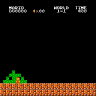
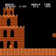
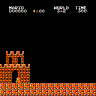
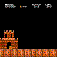
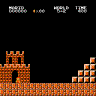
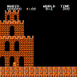

MuZero - Lite
======

This repository is a Python implementation of a heavily modified MuZero algorithm. The current configuration learns to play Super Mario Bros, but with modification it could be used to learn a number of OpenAI gym environments.

Examples
======

Below are examples of gameplay after 6 days of training on a gaming PC. This AI was trained on random overworld levels.

            

Neural Networks
======
 - Representation network: observation --> hidden state
 - Policy network: hidden state --> relative predicted value of each move
 - Value network: hidden state --> predicted value
 - Reward network: hidden state --> predicted reward
 - Dynamics network: hidden state + action --> hidden state (future)
 - Exploration network: hidden state --> predicted policy

Self Play
======
- Latest networks are loaded from file. The initial runs are performed with random moves using a Uniform network. 
- Instead of performing a Monte-Carlo tree search, actions are selected through a truncated search. The outputs of the Policy network are ranked and the highest-ranking moves are evaluated through a look-ahead search. During the look-ahead search, actions are chosen based on the maximum output of the Policy network. This ensures that the future value of an action is estimated in the context of the current policy.
- Policy exploration is not random. It is guided by an adversarial Exploration network.
- In self play during training, actions are selected with a probability based on their estimated value. This ensures that some off-policy actions are observed to help train the Value network.
- Games are saved to file instead of loaded directed into the replay_buffer.
- Gifs of each game are saved during training because they are fun to watch.

Network Training
======
- Games are loaded from file to fill the replay_buffer.
- Experiences are sampled using Prioritized Experience Replay.
- Policy network is trained to the results of the truncated search during self play. The policy trains directly to the relative predicted value of each move from the look-ahead search.
- Value network is trained to the time-discounted future value + discounted accumulated future reward.
- Reward network is trained to the reward values. Based on several recent papers and some experimentation, this network can probably be eliminated without affecting performance.
- Dynamics network is trained by unrolling future actions, policies, rewards, and values from the game history and training using the output of the Dynamics network as the hidden state.
- Exploration network is trained to the predicted policy from the Policy network. The loss value for the policy network is reduced by a fraction of the exploration network's loss. This guides the policy towards strategies it has not tried previously.
- Network updates are saved to file periodically.
- Initial training needs to be performed on random moves (self-play using the Uniform network). This sets the baseline output of the Value network near zero. If agents play using a network that has not been trained in this way, the estimated values will be inflated. Remember that the Value network trains to a bootstrap value: the estimated value inferred during self play. Without initial training, an incorrect bootstrap value can prevent the AI from learning.

**DISCLAIMER**: this code is early research code. What this means is:

- Silent bugs may exist.
- It may not work reliably on other environments or with other hyper-parameters.
- The code quality and documentation are quite lacking, and much of the code might still feel "in-progress".
- The training and testing pipeline is not very advanced.
